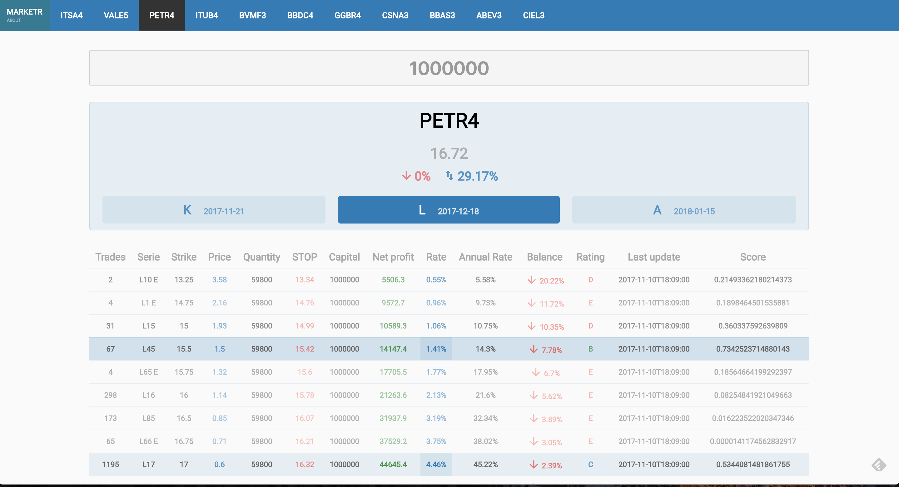

Uhtred
======================

The frontend (React.js version) for [Marketr](https://sonataxa.tech).

Marketr is a product made for investors who need curated information regarding stock options assets
at the [BMF&Bovespa](http://www.bmfbovespa.com.br/pt_br/). Its board contains the most negotiated assets at the market
and brings all the needed information for trading, including a top-feature called "Rating". Ratings are
evaluated based on Artificial Intelligence and are the main purpose of this product because it achieves
transparency, speed and accuracy while choosing the best assets to invest money.

Cutting Edge Stack (As of October 15th 2017')
--------
  * ES6
  * Webpack 3.7
  * npm@5.5 ([Yarn killer?](https://medium.com/netscape/npm-5-yarn-killer-ba69737b24d0))
  * React 16
  * Redux 3.7
  * Jest 21
  * Enzyme 3.1

Setup & Running locally
--------
	$ npm install
	$ npm run build (webpack)
	$ npm run server:dev (webpack-dev-server --inline --hot)

Testing
--------
	$ npm run tdd (jest --watch)

License
------------
Uhtred is released under the [MIT License](https://opensource.org/licenses/MIT)
