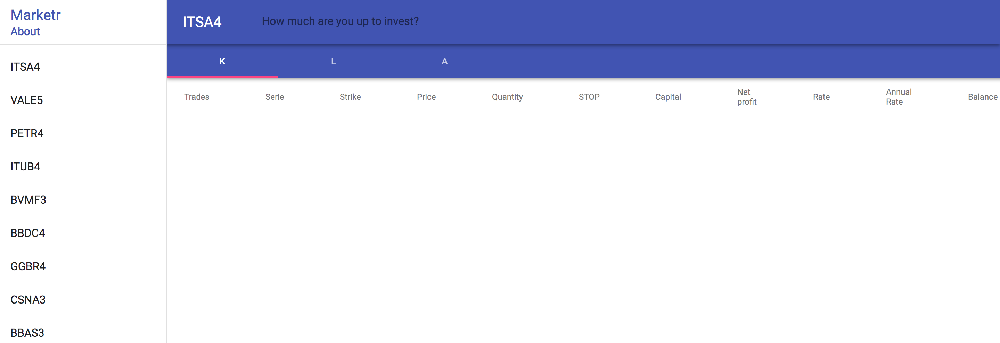
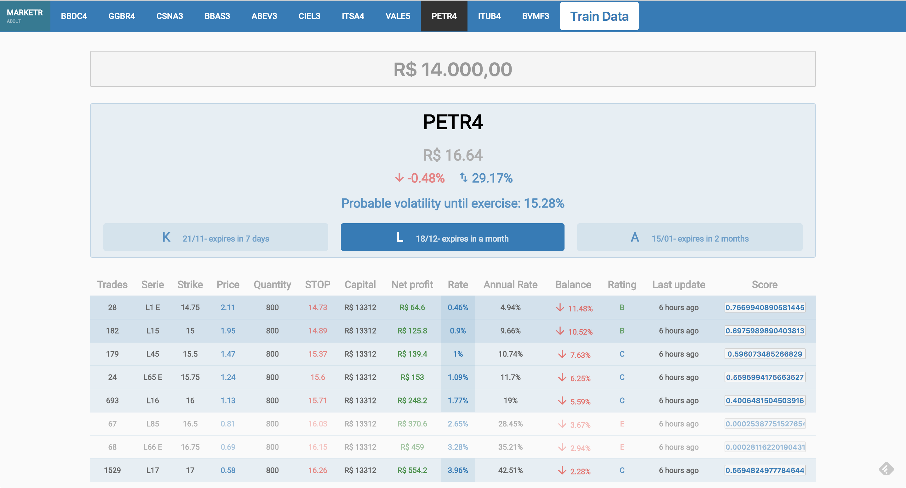
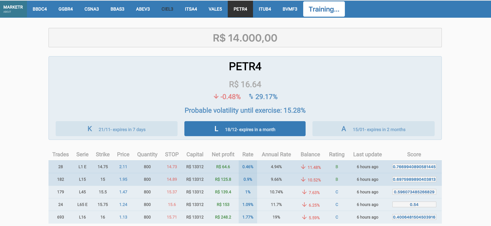

Uhtred
======================

The frontend (React.js version) for [Marketr](https://sonataxa.tech).

Marketr is a product made for investors who need curated information regarding stock options assets
at the [BMF&Bovespa](http://www.bmfbovespa.com.br/pt_br/). Its board contains the most negotiated assets at the market
and brings all the needed information for trading, including a top-feature called "Rating". Ratings are
evaluated based on Artificial Intelligence and are the main purpose of this product because it achieves
transparency, speed and accuracy while choosing the best assets to invest money.

Cutting Edge Stack (As of October 15th 2017')
--------
  * ES6
  * Webpack 3.7
  * npm@5.5
  * React 16
  * Redux 3.7
  * Jest 21
  * Enzyme 3.1

Screenshots
-----------

It's even possible to train your data from the UI:

Setup & Running locally
--------
	$ npm install
	$ npm run build (webpack)
	$ npm run server:dev (webpack-dev-server --inline --hot)

Docker usage
--------
This app uses docker for containerization:

	# builds the web app container
	docker-compose build

	# starts up and listens to http://localhost:8080
	docker-compose up

	# running commands inside web container
	docker exec -it uhtred_web_1 bash -c "curl http://localhost:8080"

	# happy TDD!
	docker-compose run tdd

	# stop everything
	docker-compose down

Testing
--------
	$ npm run tdd (jest --watch)
	$ docker-compose run tdd

License
------------
Uhtred is released under the [MIT License](https://opensource.org/licenses/MIT)
